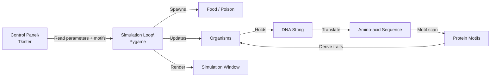

# DNA Mutation Simulation (Python)

An educational simulation/game that explores how **DNA mutations** can affect organism behavior over time.

This project simulates a population of simple organisms whose behaviors are influenced by a:

**DNA → codon → amino acid → “protein motif” → trait/behavior** mapping.

You can tune mutation/environment parameters live and observe how the population adapts (or collapses) under different conditions.

**Status:** Personal / educational project. Not a commercial product.

---

## What this simulation demonstrates

This is a “toy biology” system that intentionally simplifies real genetics in order to be visual and interactive:

- **Mutation changes DNA**
- DNA is translated into a **toy amino-acid sequence**
- The amino-acid sequence is scanned for short motifs (“proteins”)
- Protein counts influence organism traits such as:
  - how far they can “sense” food/poison (perception radius)
  - how strongly they steer toward food / away from poison

Over time, organisms reproduce, mutate, and compete for resources. The population composition changes depending on the environment and the mutation rate.

---

## Key ideas

### 1) DNA representation
Each organism has a DNA string made from the alphabet:

- `A, C, G, T`

New organisms start with random DNA. Children inherit a parent’s DNA and mutations are applied during replication.

### 2) Mutations
Replication mutations are modeled as a mix of operations:

- **Substitution**: change a nucleotide at a random position
- **Insertion**: add a random nucleotide
- **Deletion**: remove a nucleotide
- **Rare duplication**: duplicate the DNA string (very rare)

The expected number of mutation operations scales roughly with:

`dna_length * mutation_rate`

> Note: This is an educational approximation, not a biologically accurate mutation model.

### 3) Translation: DNA → amino acids
The simulation looks for ORFs (“open reading frames”) in a simplified way:

- Find `ATG` as a **start codon**
- Translate codons (triplets) until a **stop codon** is hit:
  - `TAA`, `TAG`, `TGA`

Codons are mapped to amino acids using a standard codon table (simplified for this demo).  
Translated regions are wrapped in markers:
- `&` = ORF start
- `_` = ORF end

### 4) Proteins as short motifs
Instead of folding proteins, this simulation treats proteins as **short amino-acid motifs** (tiny sequences like `"ST"`).

A “protein” is defined as:
- `name`: e.g. `food_perception`
- `sequence`: e.g. `"ST"`

The translated amino-acid sequence is searched for each motif. The number of matches controls traits.

Default motifs (editable in the UI):
- `food_perception`: `ST`
- `poison_perception`: `AI`
- `green_tail+`: `PR`
- `green_tail-`: `LR`
- `red_tail+`: `QR`
- `red_tail-`: `RR`

### 5) Traits → behavior
Each organism has:
- **food perception radius**
- **poison perception radius**
- **steering forces** toward/away from items

Protein counts influence these values. Example intuition:
- more `food_perception` motifs → bigger green radius (detect food from farther away)
- more `poison_perception` motifs → bigger red radius (detect poison from farther away)
- tail motifs influence whether the organism tends to steer toward food or away from poison

---

## UI and visualization

This project opens two windows:

1) **Simulation window (pygame)**  
   Shows organisms, food, poison, and steering cues.

2) **Control Panel (Tkinter)**  
   Lets you change environment/genetics parameters and edit protein motifs while running.

### Visual legend (simulation window)
- **Green dots**: food
- **Red dots**: poison
- **Organism body color**: health-based (red → green)
- **Green circle around organism**: food perception radius
- **Red circle around organism**: poison perception radius
- **Green line**: “food steering” influence
- **Red line**: “poison steering” influence
- **Blue fill**: currently selected organism (via listbox)

---

## Requirements

- Python 3.9+ recommended
- Dependencies:
  - `pygame`
  - `numpy`
  - `tkinter` (usually included with Python on Windows/macOS; on some Linux distros you may need to install it separately)

Install:

```bash
pip install pygame numpy
```

---

## How to run

```bash
python Dna_Simulation.py
```

Optional (for reproducible runs):
```bash
python Dna_Simulation.py --seed 123
```

Optional (window size / fps):
```bash
python Dna_Simulation.py --width 1000 --height 600 --fps 60
```

---

## Parameters you can tune

In the Control Panel you can adjust:

### Environment
- **Food Rate (%)**: how often food appears
- **Poison Rate (%)**: how often poison appears
- **Max Poison**: cap for poison items (oldest poison removed)

### Population
- **Min Organisms**: keeps at least N organisms alive (spawns new ones if needed)

### Genetics and evolution
- **Mutation Rate**: higher → more DNA changes each replication
- **Reproduction Rate**: probability of producing a child each tick
- **DNA Length**: longer DNA can contain more ORFs/motifs but costs more mutation surface

### Movement and energy
- **Max Velocity**
- **Initial Health**

### Protein motifs
You can edit the protein name + amino-acid motif sequences.  
This is where the simulation becomes fun: you can “define the genome logic” by choosing what motifs matter.

> Tip: Short motifs (2–3 chars) will appear more often randomly. Longer motifs become rare but more “meaningful”.

---

## Architecture



---

## Educational notes and limitations

This simulation is **not** biologically accurate. It is designed to illustrate concepts:

- randomness + mutation
- selection pressure (food vs poison balance)
- trait emergence from encoded patterns

Things this simulation does **not** model:
- real gene regulation
- protein folding/structure
- real metabolism/energy budgeting
- proper population genetics/statistics

Still, it’s useful as a sandbox to build intuition.

---

## Safety / ethics

This project is purely a simulation. It does not process real genetic data.  
Use it as an educational tool and a playful coding experiment.

---

## License

Add a `LICENSE` file (MIT/Apache-2.0/etc.)

## Screenshots

### Simulation


### Reference visuals (educational)


