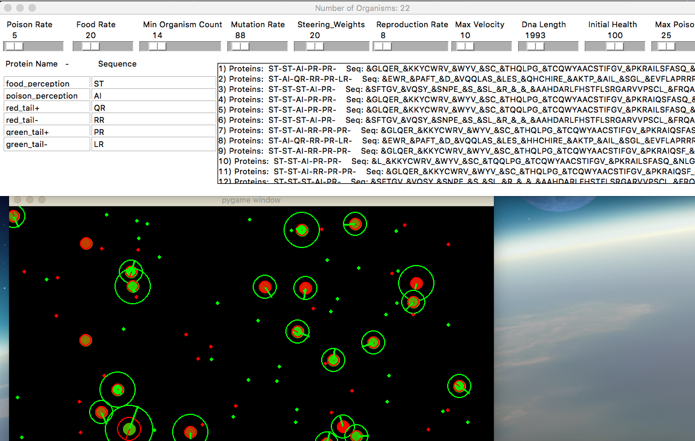
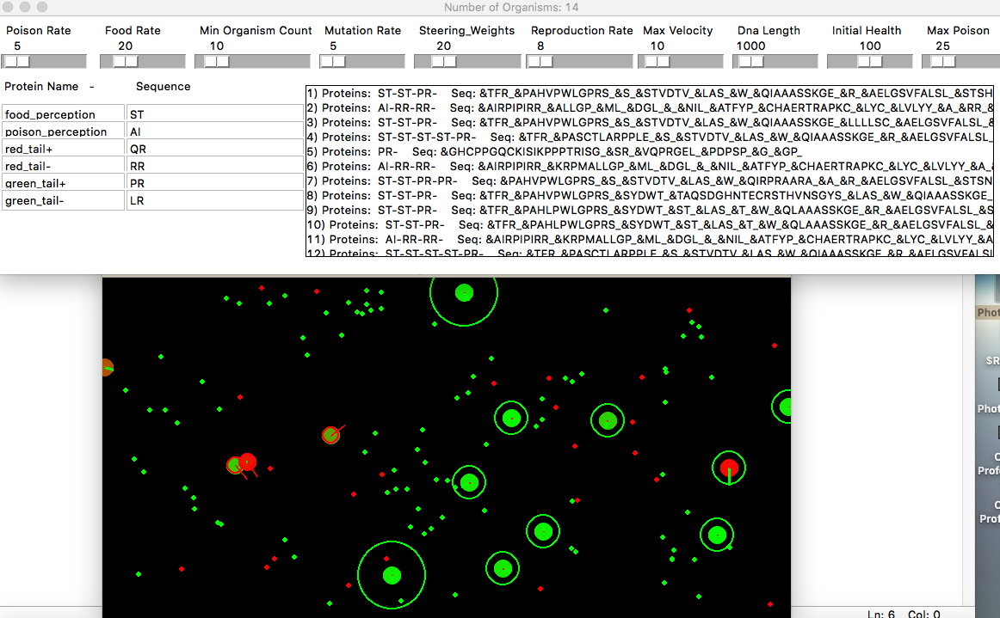
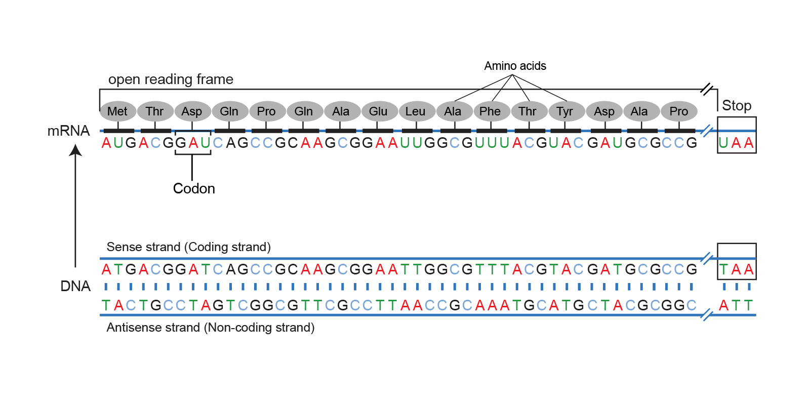
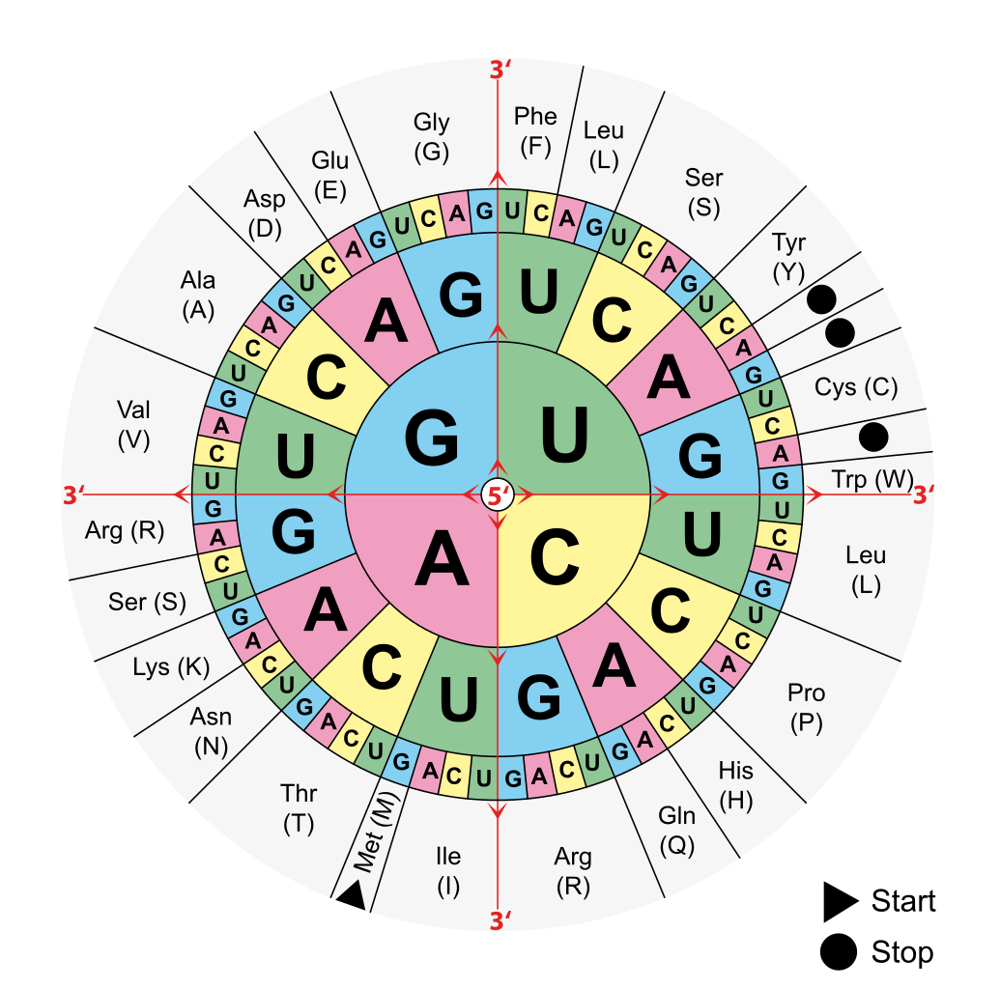
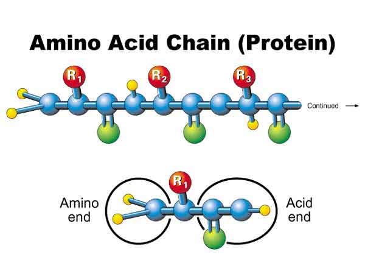

# DNA Mutation Simulation (Python)

An educational simulation/game that explores how **DNA mutations** can affect organism behavior over time.

This project simulates a population of simple organisms whose behaviors are influenced by a **DNA → codon → amino acid → protein** style mapping. You can tune mutation and environment parameters and observe how the population evolves.

> Status: Personal / educational project. Not a commercial product.

---

## What you can do
- Adjust simulation parameters via a settings panel (mutation rate, reproduction, food/poison rates, DNA length, etc.).
- Configure DNA length and protein sequences to shape organism traits.
- Use real nucleotide codon mappings for amino acids (educational focus).

---

## Screenshots

### Simulation

### Reference visuals (educational)

> Note: If any image above is sourced from external material, please open an issue/PR to add attribution
> or I will replace it with original visuals.

---

## Key parameters (examples)
From the UI you can tune settings such as:
- Poison rate, food rate, minimum organism count
- Mutation rate, reproduction rate, max velocity
- DNA length, initial health, max poison
- Steering/behavior weights

(Exact names may vary by version.)

---

## How to run

### 1) Clone

bash
git clone https://github.com/taskma/Dna-mutation-simulation.git
cd Dna-mutation-simulation

2) Install dependencies

  Create a venv (recommended) and install:
  
  python -m venv .venv
  # Windows: .venv\Scripts\activate
  source .venv/bin/activate
  
  pip install -U pip
  pip install pygame

3) Start the simulation

   python Dna_Simulation.py

Project structure (high-level)
	•	Dna_Simulation.py — main entry point (simulation loop + UI)
	•	UIcontrols.py — UI controls / settings panel
	•	Protein.py — protein representation / mapping helpers

⸻

Roadmap (optional)
	•	Add requirements.txt
	•	Add basic CI (lint + run import check)
	•	Improve documentation of the DNA/protein mapping
	•	Add a short demo GIF

⸻

License

No explicit license file yet.
If you want others to reuse it, add a LICENSE (MIT/Apache-2.0 are common choices).

Simulation Screen 1

*

*

*

Simulation Screen2

